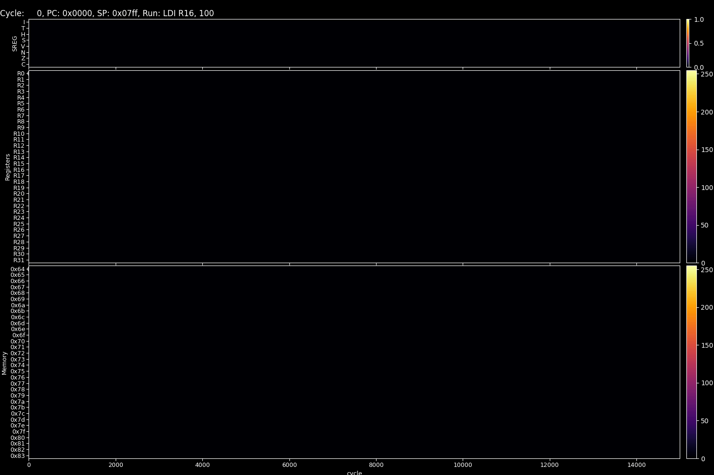

Tiny8 documentation
=====================

.. image:: https://img.shields.io/pypi/v/tiny8
   :target: <https://img.shields.io/pypi/v/tiny8>

.. image:: https://img.shields.io/github/license/sql-hkr/tiny8
   :target: <https://img.shields.io/github/license/sql-hkr/tiny8>

.. image:: https://img.shields.io/pypi/pyversions/tiny8
   :target: <https://img.shields.io/pypi/pyversions/tiny8>

.. image:: https://img.shields.io/github/actions/workflow/status/sql-hkr/tiny8/ci.yml?label=CI
   :target: <https://img.shields.io/github/actions/workflow/status/sql-hkr/tiny8/ci.yml?label=CI>

Tiny8 is a lightweight toolkit that allows you to explore how computers work at their core through small-scale memory models, handcrafted assembly, and lightweight in-memory data structures.
Designed for rapid experimentation, Tiny8 embraces minimalism with zero unnecessary dependencies, a clean design, and intuitive visualization tools that make learning, debugging, and tinkering enjoyable.

⭐️ NEW FEATURE!

.. image:: https://github.com/user-attachments/assets/cd5a0ae0-8aff-41af-81e0-4ff9c426f617
   :alt: CLI visualizer
   :width: 600px

Installation
------------

Tiny8 supports Python 3.11 and newer. It has no heavy external dependencies and is suitable for inclusion in virtual environments.
Follow the steps below to prepare your environment and install from source or PyPI.

Prerequisites

- Python 3.11+
- Git (for installing from the repository)
- Recommended: create and use a virtual environment

From source (development)

.. code-block:: bash

   git clone https://github.com/sql-hkr/tiny8.git
   cd tiny8
   uv venv
   source .venv/bin/activate
   uv sync

.. tip::

   `uv <https://docs.astral.sh/uv/>`_ is an extremely fast Python package and project manager, written in Rust. To install it, run:

   .. code-block:: bash

      # On macOS and Linux.
      curl -LsSf https://astral.sh/uv/install.sh | sh

      # On Windows.
      powershell -ExecutionPolicy ByPass -c "irm https://astral.sh/uv/install.ps1 | iex"

This flow sets up a development virtual environment, installs development requirements, and prepares the project for local editing and testing.

From PyPI (stable)

.. code-block:: bash

   uv add tiny8

CLI Visualizer
--------------

Tiny8 includes a lightweight terminal-based visualizer that lets you step through a program's execution trace in your terminal. It shows the status register (SREG), the 32 general-purpose registers, and a compact view of a configurable memory range for each step.

Key points
~~~~~~~~~~

- The CLI visualizer expects the CPU to have a populated ``step_trace`` (run the CPU first with ``cpu.run(...)``).
- Controls are keyboard-driven (play/pause, step forward/back, jump, quit) and work in most POSIX terminals that support curses.
- For higher-fidelity animations (GIFs) and interactive matplotlib views, use the ``Visualizer`` class which requires ``matplotlib``.

Interactive controls
~~~~~~~~~~~~~~~~~~~~

.. code-block:: text

   Space - toggle play/pause
   l or > - next step
   h or < - previous step
   w - jump forward 10 steps
   b - jump back 10 steps
   0 - jump to first step
   $ - jump to last step
   q or ESC - quit

Programmatic usage
------------------

You can invoke the terminal visualizer directly from Python after running the CPU:

.. code-block:: python

   from tiny8 import CPU, assemble_file
   from tiny8 import run_cli

   prog, labels = assemble_file("examples/bubblesort.asm")
   cpu = CPU()
   cpu.load_program(prog, labels)
   cpu.run(max_cycles=15000)

   # Run the curses-based CLI visualizer
   run_cli(cpu, mem_addr_start=100, mem_addr_end=131)

Tiny8 provides a ``tiny8`` console script (see ``pyproject.toml``). You can run the CLI or the animation mode directly:

.. code-block:: bash

   # Run the curses-based CLI visualizer for an assembly file
   uv run tiny8 examples/bubblesort.asm # --mode cli --mem-start 100 --mem-end 131

   # Produce an animated GIF using matplotlib (requires matplotlib)
   uv run tiny8 examples/bubblesort.asm --mode ani -o bubblesort.gif --mem-start 100 --mem-end 131 --plot-every 100 --fps 60

.. important::

   Tiny8 uses Python's built-in curses module (Unix-like systems). On Windows, use an appropriate terminal that supports curses or run via WSL.

Examples
--------

.. toctree::
   :maxdepth: 2

   examples/index

API Reference
---------------

The API section documents the public modules, classes, functions, and configuration options.
It includes usage notes, parameter descriptions, and return value details so you can use the library reliably in production code.

.. toctree::
   :maxdepth: 2

   api/tiny8

License
-------

Tiny8 is licensed under the MIT License. See `LICENSE <https://github.com/sql-hkr/tiny8/blob/main/LICENSE>`_ for details.
Contributions, bug reports, and pull requests are welcome; please follow the repository's CONTRIBUTING guidelines.
